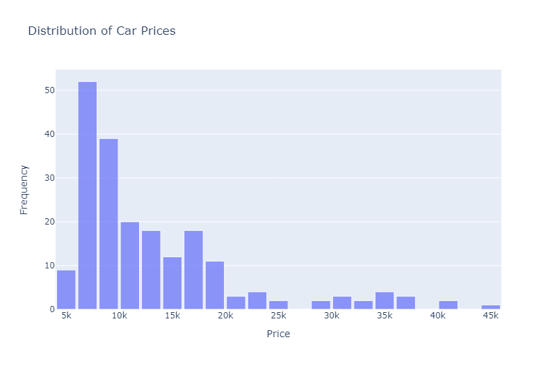
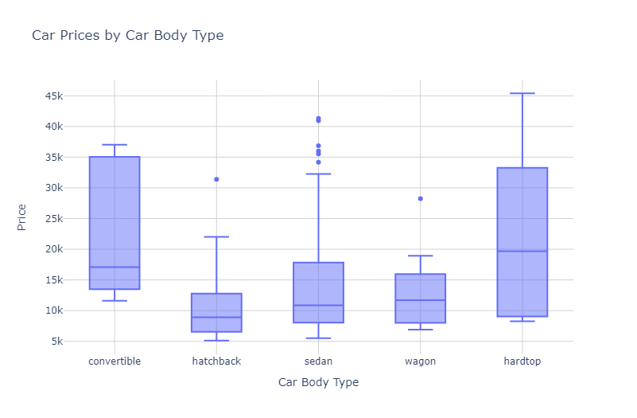
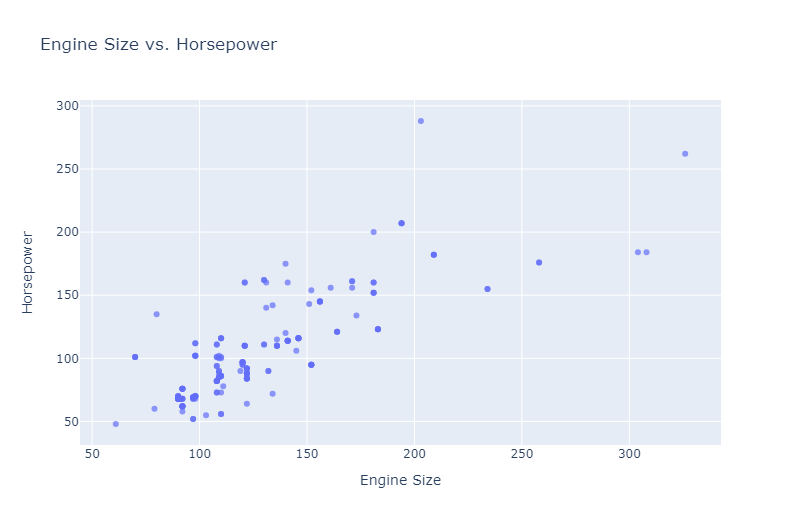

# Car Price Prediction: 95% Accuracy Achieved

## Overview

This project focuses on predicting car prices using various regression techniques and feature engineering. We achieved a remarkable 95% accuracy in our predictions.

## Dataset

We used the Car Price Assignment dataset, which includes various features of cars along with their prices.

## Exploratory Data Analysis

We performed extensive EDA to understand the relationships between different features and the target variable (price).

## Feature Engineering

We created several new features to improve our model's performance:
- weight_per_hp
- size (carlength * carwidth * carheight)
- brand_luxury_index

## Models Used

1. Linear Regression
2. Ridge Regression
3. Lasso Regression

## Conclusion

Through careful feature engineering and model selection, we were able to create a highly accurate car price prediction model. The engineered features proved to be valuable in improving the model's performance.

## Author

Omar Medhat

## Acknowledgments

- Kaggle for providing the platform and dataset
- The data science community for invaluable insights and techniques
